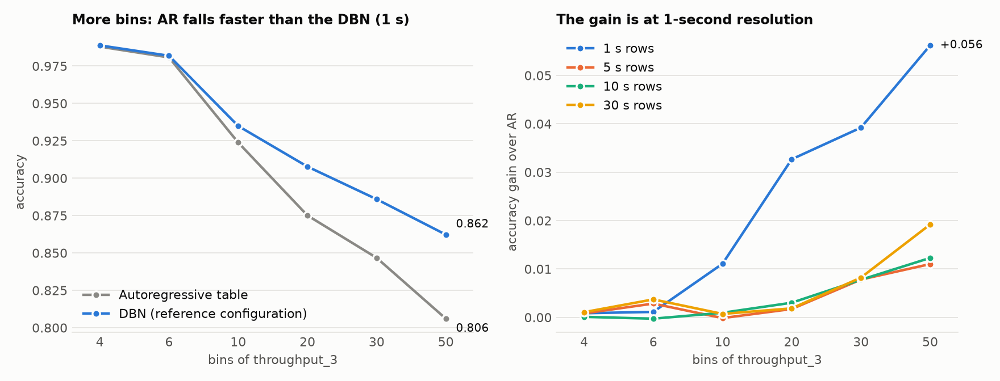

# DBN model building — fixes, ablation and TabPFN comparison

7 October 2026. Work done on branch `audit-fixes` (nothing committed, nothing pushed).

## 1. Headline

1. **The DBN now beats the autoregressive model**, on all three datasets, once the
   data is in the right order, modelled at 1 s, and the target's table is
   estimated sensibly. At 1 s and 20 bins: accuracy 0.908 against 0.875 for the
   autoregressive table, log-loss 0.338 against 0.487. The gap is significant
   (paired bootstrap over 1 401 test runs, 95% interval of the accuracy gain
   +0.028 to +0.037).
2. **More bins and finer time both help the DBN relative to AR, as you expected.**
   At 1 s the accuracy gain over AR grows from +0.001 (4 bins) to +0.033
   (20 bins), +0.056 (50 bins) and +0.092 (100 bins). At 5 s or coarser, with
   20 bins, it is +0.003 or less: what the DBN can anticipate is a load change
   travelling down the chain, which takes a few seconds.
3. **Two modelling choices, not the data, were what kept the student's model at AR level**
   (beyond the data-preparation bugs):
   - BIC adds no parent to the target once it has many bins, so the "DBN" was
     the AR table;
   - when a search does add parents, pgmpy's default (uniform) prior makes the
     model *worse* than AR, because most parent combinations were never seen.
     Letting unseen combinations fall back to the AR table removes the problem.
4. **Against TabPFN (v2, see §7 for why not the newest):** at 1 s the DBN is
   level with it or slightly ahead on the bins (0.908 against 0.902 at 20 bins,
   0.864 against 0.855 at 50) and has the better log-loss; TabPFN gives the
   clearly better continuous forecast (MAE 3.9 against 5.6 requests/s). At 30 s
   TabPFN is ahead of the plain DBN (0.947 against 0.921 at 4 bins); the DBN
   with chain inference at configuration changes matches it (0.949).
5. **As a number, the bin table alone is not better than "same as now"**, but
   replacing the target's table by a conditional-median node on the same
   parents is: 4.14 requests/s against 4.65 for persistence at 1 s (gradient
   boosting 4.23; TabPFN 3.92 on its test subsample). See §5.9 and §5.13.
6. **The same recipe works for every variable of the system**, not only
   `throughput_3`: the other throughputs, the latencies and the queue lengths
   all beat their AR table at 20 bins (§5.11). And the full pgmpy graph, with
   the domain constraints in place, learns the service chain by itself (§5.12).

Everything below is the detail: what was fixed (§2), the new tools (§3), how
models are scored (§4), results (§5), the complete list of options (§6), TabPFN
(§7), open points (§8), and how to reproduce (§9).

---

## 2. Fixes

| # | Problem | Fix | Where | Checked by |
|---|---|---|---|---|
| 1 | Wide table sorted by run tag (a string), not by time; the sweep then treated row order as time. Folds were sorted by `cores` of service 1. | Converter writes rows chronologically with a `run_id` per measurement window; also streams the dump instead of loading 4.7 GB of strings. | `data_prep/convert_prom_dump.py` | 560 runs × 361 rows in each dump, timestamps monotonic, 30 s gap between runs |
| 2 | 30-row averages ignored run boundaries (8% of rows mixed two configurations). | Aggregation is done inside each run, aligned to its start; incomplete trailing windows are dropped. Granularity is now an option, default 1 s. | `dbn/data.py` (`aggregate`) | 12 rows per run at 30 s, none mixing runs |
| 3 | Every "next step" (lags, velocities, two-slice data, persistence, AR, evaluation) was taken by shifting rows, across run boundaries. | All of them use explicit (t, t+h) row pairs inside a run, plus — as a separate, flagged set — the last row of a run paired with the first row of the next (the configuration change). | `dbn/data.py` (`pair_index`), `dbn/dbn_structure.py`, `dbn/dbn_sweep.py` | pairs verified: horizon exact inside runs; 559 change pairs, 30.2–30.3 s apart |
| 4 | Reconstructed `rps` shifted by 40–60 s; and redundant. | `rps` is now the applied load (`buffer_size_1`). `add_rps_feature.py` still exists, estimates the clock offset (48 s / 37 s / 61 s for the three dumps) and explains why the measured load is preferable. | `dbn/data.py`, `data_prep/add_rps_feature.py` | periodic dump: 92% of rows agree after alignment, 27% before |
| 5 | Folds cut runs in two. | Folds are made of whole runs; expanding-window (as before) or blocked. | `dbn/data.py` (`make_temporal_folds`) | no run shared by train and test |
| 6 | Cumulative counters (`*_total`) used as levels: they only encode elapsed time. | Converted to per-second increase inside each run. `process_cpu_seconds_rate_*` is then the CPU actually used. | `dbn/data.py` | — |
| 7 | The model was never told the configuration / load of the step it predicts. | Cores, data quality and `rps` are exogenous: no learned parents, and their value at t+h is given as evidence (`--exog`, default `controls+load`). | `dbn/dbn_structure.py`, `dbn/dbn_sweep.py` | — |
| 8 | `TARGET_PARENTS_ONLY=True` reduced the target's parents to its own past, so the learned structure could not affect the prediction. | New default `"observed"`: the target may take any parent that is observed at prediction time (anything at t, exogenous variables at t+h). The old behaviour is `"ar_only"`. | `dbn/dbn_structure.py` | — |
| 9 | Parents of the target were chosen in two separate searches (same-slice, then lagged) and added up, with forced lags on top: up to 8–11 parents, tables with 10⁶–10²² columns. | Exogenous same-slice parents now compete inside the two-slice search for the same `max_indegree` slots. Forced lag default is 0. A table larger than 2·10⁶ columns is refused (target) or pruned with a message (other nodes) before pgmpy allocates it. | `dbn/dbn_structure.py` | 1 s / 20 bins: 3–4 parents, no failure |
| 10 | Uniform (BDeu) prior on the target's table: unseen parent combinations predict "all bins equally likely". | Option `CPT_PRIOR="backoff"` (default): the prior of every column is the AR table's column. | `dbn/dbn_structure.py` (`backoff_cpd`) | identical to the harness on the same data |
| 11 | States taken from the training data only: a bin seen only in test made the fold fail (`FAIL: 8`). | State space covers train and test bins. | `dbn/dbn_sweep.py` | no failed fold in the test runs |
| 12 | Controls (6 or 10 distinct values) were spread over `n_bins` mostly empty bins. | Columns with few distinct values keep one state per value. | `dbn/dbn_sweep.py` | — |
| 13 | Evaluation looped over rows with `iloc` and one inference query per distinct full evidence. | Vectorised; when all parents of the target are observed only those are passed (exact). Also reports accuracy on the steps where the target changes bin. | `dbn/dbn_sweep.py` (`evaluate`) | — |
| 14 | Mutual-information feature selection on >100k rows would take hours at 1 s. | MI is estimated on 20 000 random training rows. | `dbn/dbn_sweep.py` | — |
| 15 | Control flag only looked at data quality; meaningless after the reorder (a configuration is constant inside a run). | Looks at cores too; off by default — the exogenous inputs carry the same information. | `dbn/dbn_sweep.py` | — |
| 16 | `markov_test.py` and `lstm_baseline.py` excluded the target's own past from the inputs; LSTM trained for 100 full-batch steps; both read a hard-coded path; lags crossed runs. | Target history included, run-aware windows and folds, mini-batches, `--csv`. They no longer overwrite the tracked result files. | `analysis/` | both run; see §5.14 |
| 17 | `markov_order_analysis.py`, `control_variable_check.py`: row-order loaders, lags across runs. | Use the shared loader; lags inside runs; the control check compares the step on which the configuration changes. | `analysis/` | both run; see §5.14 |
| 18 | The orchestrator does not record its clock or the load it applies. | Writes `rps_log_<...>.csv` (time, orchestrator clock, rps, run tag). **Not tested** — needs a live workbench. | `data_collection/experiment_orchestrator.py` | parses only |

Not changed: `dbn/joint_dbn.py` (still reads a hard-coded path; it already
handled runs correctly), `analysis/visualize_sweep.py`,
`analysis/statistical_significance.py` (see §8).

The fixed pgmpy sweep was run end to end on a small grid:

| Granularity, bins | Discretiser | Score | DBN acc | AR acc | DBN log-loss | AR log-loss | Time per configuration (5 folds) |
|---|---|---|---|---|---|---|---|
| 1 s, 20 | uniform | AIC | 0.912 | 0.887 | 0.360 | 0.478 | 289 s |
| 1 s, 20 | uniform | BIC | 0.911 | 0.887 | 0.354 | 0.478 | 156 s |
| 1 s, 20 | quantile | AIC | 0.827 | 0.806 | 0.529 | 0.667 | 323 s |
| 1 s, 20 | quantile | BIC | 0.804 | 0.806 | 0.624 | 0.667 | 125 s |
| 30 s, 10 | uniform | AIC | 0.876 | 0.875 | 0.575 | 0.591 | 50 s |
| 30 s, 10 | uniform | BIC | 0.875 | 0.875 | 0.599 | 0.591 | 21 s |

(periodic dataset, K = 4, Markov-blanket feature selection.) The default grid
has 360 configurations; at 1 s that is roughly 20 hours per dataset.

---

## 3. New tools

| File | What it is |
|---|---|
| `dbn/data.py` | Shared data layer (loading, run bookkeeping, aggregation, folds, pairs). Every script now imports it; there were five copies of the loader. |
| `dbn/ablation.py` | Fast harness for the options in §6. With slice t fully observed, the prediction of the target depends only on the target's parent set and table, so that is what it models, with numpy counting instead of generic inference: a configuration takes seconds at 1 s. `--check-pgmpy` confirms it gives the same probabilities as pgmpy (max difference 3·10⁻¹⁶) and the same BIC. Stores per-run results for paired tests. |
| `dbn/dynotears.py` | DYNOTEARS, written from the paper (causalnex does not install on Python 3.12). Recovers a synthetic SVAR exactly (all edges, weights within 0.03). |
| `analysis/ablation_report.py` | One row per configuration, pooled over datasets: effect against AR and against the reference configuration, 95% interval and p-value from a paired bootstrap over runs, Holm-corrected. |
| `analysis/tabpfn_baseline.py`, `analysis/tabpfn_report.py` | DBN, AR, persistence, TabPFN and gradient boosting on identical inputs, folds and test samples. |

---

## 4. How models are scored

- **Task.** Predict the bin of `throughput_3` at t+h from everything observed up
  to t, plus cores, data quality and load at t+h.
- **Samples.** Every (t, t+1) pair inside a run, plus the 559 configuration
  changes per dataset. At 1 s that is ≈ 200 000 samples per dataset.
- **Folds.** Five expanding-window folds of whole runs (train on the first
  chunk(s), test on the next).
- **Models compared on the same samples and bins:** the configuration under
  test ("DBN"), the AR table P(bin′ | bin), and persistence.
- **Metrics.**
  - *Accuracy*: predicted bin is right. Not comparable across bin counts — more
    bins is a harder question — so the tables always give AR next to it.
  - *Log-loss*: quality of the predicted probabilities (lower is better).
  - *Accuracy at a bin change*: accuracy on the samples where the target
    leaves its bin. Persistence scores 0 there by construction.
  - *Accuracy at a configuration change*: accuracy on the 559 run-to-run pairs.
  - *MAE*: the forecast read as a number, in requests/s (§5.9).
- **Significance.** Per-run sums are stored; differences between two models
  are bootstrapped over runs (10 000 resamples), pooled over the three
  datasets (1 401 test runs). Rows inside a run are far from independent, runs
  are separated by a reconfiguration. p-values are Holm-corrected within a
  study; the smallest value the bootstrap can return is 10⁻⁴ before correction.

**Reference configuration** (the centre of the one-factor study): 1 s,
horizon 1, 20 uniform bins for the target, throughput_1/2 and `rps` on the
same bin edges, other variables in 20 quantile bins, candidates = service
metrics at t and exogenous variables at t+h, parents chosen by forward
selection on an inner validation split (max 4), backoff prior.

---

## 5. Results

All numbers are pooled over the three datasets unless a dataset is named.
Full tables: `results/ablation/summary_<study>.csv`.

### 5.1 The DBN against AR

| Model (1 s, 20 bins) | Accuracy | Log-loss | Accuracy at a bin change |
|---|---|---|---|
| Persistence | 0.877 | — | 0 |
| AR table | 0.875 | 0.487 | 0.013 |
| DBN as the pipeline built it (BIC search, uniform prior) | 0.874 | 0.489 | 0.020 |
| DBN, reference configuration | **0.908** | **0.338** | **0.383** |
| DBN, best combination (§5.8) | **0.919** | **0.277** | **0.516** |

Per dataset the reference DBN scores 0.915 (periodic), 0.909 (once-in-a-lifetime)
and 0.899 (unpredictable).

The parents the search keeps are, almost always, `throughput_3` at t,
`throughput_2` at t and `buffer_size_3` at t, sometimes one data-quality
setting: the DBN has learned that what service 2 emits now, and what is queued
at service 3, is what service 3 will emit next.

### 5.2 Bins × granularity

Accuracy gain of the reference DBN over AR (same bins, same samples); AR's own
accuracy in brackets.

| Bins | 1 s | 5 s | 10 s | 30 s |
|---|---|---|---|---|
| 4 | +0.001 (0.988) | +0.001 (0.977) | +0.000 (0.968) | +0.001 (0.920) |
| 6 | +0.001 (0.981) | +0.003 (0.959) | −0.000 (0.938) | +0.004 (0.884) |
| 10 | +0.011 (0.924) | −0.000 (0.928) | +0.001 (0.917) | +0.001 (0.880) |
| 20 | **+0.033** (0.875) | +0.002 (0.887) | +0.003 (0.878) | +0.002 (0.837) |
| 30 | **+0.039** (0.847) | +0.008 (0.861) | +0.008 (0.826) | +0.008 (0.779) |
| 50 | **+0.056** (0.806) | +0.011 (0.809) | +0.012 (0.792) | +0.019 (0.705) |
| 100 | **+0.092** (0.697) | | | |

- AR does fall as bins increase: 0.988 → 0.697 at 1 s.
- With 4 or 6 bins there is nothing to gain at any granularity: a load change
  of 5–15 requests/s almost never crosses a bin 80–125 requests/s wide.
- The log-loss gain is significant in every cell (the DBN's probabilities are
  better even where the most likely bin is the same).
- The pgmpy-equivalent configuration (BIC + uniform prior) equals AR in every
  cell with 20 bins or more: BIC keeps `throughput_3(t)` as the only parent.

### 5.3 One factor at a time (1 s, 20 bins)

Difference to the reference configuration; negative log-loss is better.
"n.s." = not significant after Holm correction (p > 0.05).

| Option | Value | Accuracy | Δ accuracy | Δ log-loss | Verdict |
|---|---|---|---|---|---|
| — | reference | 0.908 | | | |
| **Table prior** | uniform (BDeu) | 0.867 | −0.041 | +0.196 | much worse — worse than AR |
| Prior strength (backoff) | 1 / 3 / 30 / 100 | 0.906 / 0.909 / 0.906 / 0.901 | −0.002 / +0.001 / −0.002 / −0.007 | +0.020 / +0.007 / −0.002 / +0.003 | 10–30 is right; little sensitivity |
| **Structure search** | forward selection on validation loss (reference) | 0.908 | | | best |
| | BDeu-score hill climbing | 0.903 | −0.005 | +0.017 | close |
| | conditional mutual information, top 3 | 0.900 | −0.008 | +0.021 | close |
| | lasso path | 0.896 | −0.012 | +0.044 | |
| | AIC hill climbing | 0.894 | −0.014 | +0.061 | |
| | DYNOTEARS | 0.890 | −0.018 | +0.080 | better than AR, behind the discrete searches |
| | fixed expert parents (chain + service-3 controls) | 0.884 | −0.024 | +0.095 | 5 parents is too many for one table |
| | BIC counting only observed parent combinations | 0.881 | −0.027 | +0.123 | |
| | BIC hill climbing | 0.875 | −0.033 | +0.146 | = AR |
| Same searches with the uniform prior | BDeu / CMI / lasso / AIC / DYNOTEARS | 0.749 / 0.749 / 0.690 / 0.846 / 0.849 | −0.06…−0.22 | +0.29…+0.99 | all worse than AR |
| Max parents | 2 / 3 / 5 / 6 | 0.903 / 0.909 / 0.908 / 0.908 | −0.004 / n.s. / 0 / 0 | +0.027 / n.s. / −0.002 / −0.002 | 3–4 is enough |
| **Lags of the other variables** | 2 / 3 / 5 | 0.918 / 0.919 / 0.919 | **+0.011** | **−0.046 / −0.049 / −0.049** | helps; nothing beyond 3 |
| Lags of the target | 2 / 3 / 5 | 0.908 | n.s. | −0.011 | small |
| Velocity of every variable | sign / binned | 0.908 / 0.908 | n.s. | −0.009 / −0.011 | small |
| Lags 2 + velocity | | 0.918 | +0.010 | −0.044 | no better than lags alone |
| Target as a change of bin | | 0.908 | 0 | +0.002 | no effect |
| Distance to upstream throughput as a feature | | 0.907 | n.s. | n.s. | no effect |
| **Throughputs on shared bin edges** | off | 0.888 | −0.020 | +0.030 | keep on |
| Bins of the other variables | 6 / 10 | 0.906 / 0.907 | n.s. | n.s. | no effect |
| Discretiser of the other variables | uniform / k-means | 0.907 / 0.908 | n.s. | n.s. | no effect |
| Discretiser of the target | quantile / k-means | 0.862 / 0.944 | (different bins) | | see below |
| Exogenous inputs | none / controls only | 0.910 / 0.908 | +0.002 (significant, tiny) / 0 | n.s. | not needed inside a run at 1 s — decisive at configuration changes, §5.5 |
| Variable pool | + process / GC metrics | 0.908 | n.s. | n.s. | no effect |
| Forced self-loop | off | 0.908 | 0 | 0 | always selected anyway |
| Configuration changes in training | excluded | 0.912 | (different samples) | | — |
| At a configuration change | second table / chain inference | 0.908 / 0.908 | 0 / +0.001 | −0.004 / −0.013 | chain: see §5.5 |

Target discretiser: with quantile or k-means bins the question changes (the
bins are different), so accuracy against the reference is not a fair
comparison. Against AR on the same bins, the DBN gains +0.063 with quantile
bins and +0.019 with k-means bins (uniform: +0.033).

### 5.4 Structure-learning engines

Covered in the table above. Two points worth stating separately:

- **Why BIC selects nothing.** BIC charges for every cell of the table,
  including the parent combinations that never occur. One extra 20-state
  parent multiplies the charge by 20. The data only fills a small fraction of
  those combinations, so the charge is far larger than the real number of
  estimated quantities. AIC and BDeu are less affected; scoring on held-out
  data is not affected at all.
- **DYNOTEARS** is linear and continuous. It finds `throughput_2(t)` every
  time and then picks latency or data-quality columns whose effect is not
  linear. Only λ = 0.02 was tried.

### 5.5 Configuration changes

The 559 run-to-run transitions per dataset are where persistence fails most
(19% right at 20 bins) and where neither the DBN's table nor AR helps: the
previous throughput describes the old configuration.

Writing the service chain as a same-slice network
(`rps → throughput_1 → throughput_2 → throughput_3`, each throughput also
depending on its own service's cores and data quality) and summing out the two
unobserved upstream throughputs gives, for those transitions:

| Setting | Accuracy at a configuration change: AR | second table | chain inference | Overall accuracy: AR → DBN + chain |
|---|---|---|---|---|
| 30 s, 4 bins | 0.45 | 0.62 | **0.74** | 0.920 → **0.949** |
| 30 s, 10 bins | 0.27 | 0.35 | **0.60** | 0.880 → **0.914** |
| 30 s, 20 bins | 0.18 | 0.23 | **0.45** | 0.837 → **0.865** |
| 1 s, 20 bins | 0.19 | 0.20 | **0.42** | 0.875 → 0.908 (changes are 0.3% of samples) |

So even in the original setting (30 s, 4 bins) the DBN beats AR by 2.9 points
once it is told the new configuration and reasons through the chain. This is
the one place where a network with several nodes and inference does something
a single table cannot.

### 5.6 Horizon

| Horizon at 1 s | Accuracy gain over AR | Log-loss gain |
|---|---|---|
| 1 s | +0.033 | −0.149 |
| 2 s | +0.019 | −0.134 |
| 5 s | +0.008 | −0.094 |
| 10 s | +0.005 (n.s.) | −0.084 |
| 30 s | +0.011 | −0.091 |

The advantage is largest one or two seconds ahead, which is the time a change
needs to travel from service 2 to service 3.

### 5.7 Cross-validation scheme

With blocked folds (every chunk is the test set once, trained on the other
four) instead of expanding-window: DBN 0.914 against AR 0.878 (+0.036; the
expanding-window figure is +0.033). The conclusion does not depend on the scheme.

### 5.8 Combinations

128-configuration factorial (bins × state length × search × relative feature ×
max parents) and a "best" study. Average gain over AR by factor level:

| | 10 bins | 20 bins | 30 bins | 50 bins |
|---|---|---|---|---|
| State = t only | +0.005 | +0.025 | +0.020 | +0.027 |
| State = t and t−1 | +0.009 | +0.030 | +0.025 | +0.034 |
| + velocity | +0.009 | +0.030 | +0.025 | +0.035 |
| t, t−1, t−2 + velocity | +0.010 | +0.031 | +0.025 | +0.034 |

(averaged over both searches; forward selection alone gives +0.015 / +0.040 /
+0.047 / +0.066.) Relative features and 6 instead of 4 parents change nothing.

Best configuration per bin count (two lags of every variable, chain inference
at configuration changes, forward selection, backoff prior):

| Setting | DBN accuracy | AR accuracy | Gain [95% interval] | DBN log-loss | Accuracy at a bin change |
|---|---|---|---|---|---|
| 1 s, 10 bins | 0.940 | 0.924 | +0.016 [0.011, 0.020] | 0.219 | 0.39 |
| 1 s, 20 bins | 0.919 | 0.875 | +0.044 [0.038, 0.050] | 0.277 | 0.52 |
| 1 s, 30 bins | 0.896 | 0.847 | +0.050 [0.044, 0.055] | 0.335 | 0.49 |
| 1 s, 50 bins | 0.876 | 0.806 | +0.070 [0.064, 0.077] | 0.421 | 0.53 |
| 30 s, 4 bins | 0.949 | 0.920 | +0.029 [0.026, 0.032] | 0.195 | 0.46 |
| 30 s, 10 bins | 0.914 | 0.880 | +0.034 [0.031, 0.037] | 0.377 | 0.36 |
| 30 s, 20 bins | 0.865 | 0.837 | +0.028 [0.025, 0.032] | 0.610 | 0.24 |

### 5.9 The forecast as a number

Mean absolute error in requests/s at 1 s. The DBN's forecast is turned into a
number as "current value + expected change of bin value", so that predicting
"same bin" returns the current value.

| Model | MAE, 20 bins | MAE, 50 bins |
|---|---|---|
| Persistence on the continuous value | 4.65 | 4.65 |
| AR table | 5.93 | 5.47 |
| DBN, reference | 5.85 | 4.99 |
| DBN, best combination | 5.75 | 4.84 |
| Gradient boosting (continuous; bin accuracy 0.894 / 0.829, DBN reference 0.908 / 0.862) | 4.23 | 4.23 |

The DBN anticipates that a change is coming but can only express its size in
whole bins (25 requests/s wide at 20 bins, while a typical load step is 5–15).
With more bins the error falls, but it does not go below plain persistence.
§5.13 shows that a conditional-median node on the same parents does.

### 5.11 Every variable as a target (added 7 October, second pass)

One table per variable, same recipe (1 s, forward selection, backoff prior).
With slice t observed, these tables together are the two-slice DBN: any
variable at t+1 is predicted from its own parents. Accuracy gain over that
variable's AR table, pooled over the three datasets, 95% interval in brackets.

| Target | AR accuracy (20 bins) | Reference DBN | Two lags + chain at reconfigurations | BIC + uniform prior |
|---|---|---|---|---|
| throughput_1 | 0.912 | +0.009 [0.006, 0.013] | +0.013 [0.010, 0.016] | +0.002 |
| throughput_2 | 0.888 | +0.012 [0.008, 0.015] | +0.012 [0.009, 0.015] | −0.001 |
| throughput_3 | 0.875 | +0.033 [0.028, 0.037] | +0.044 [0.038, 0.050] | −0.001 |
| avg_p_latency_1 | 0.843 | +0.023 [0.020, 0.026] | +0.023 [0.019, 0.026] | +0.003 |
| avg_p_latency_2 | 0.889 | +0.003 [0.000, 0.006] | +0.009 [0.006, 0.011] | 0 |
| avg_p_latency_3 | 0.904 | +0.005 [0.003, 0.006] | +0.010 [0.009, 0.012] | 0 |
| buffer_size_2 (quantile bins) | 0.920 | +0.006 [0.004, 0.008] | +0.007 [0.006, 0.008] | +0.001 |
| buffer_size_3 (quantile bins) | 0.879 | +0.003 [−0.002, 0.007] | +0.012 [0.010, 0.014] | −0.001 |

- Log-loss improves for every target (−0.06 to −0.21).
- The gain is largest for `throughput_3` because it is the end of the chain:
  there is the most upstream information to anticipate it with. `throughput_1`
  depends almost only on the load and its own service's settings.
- With 10 bins the gains shrink to +0.005 or less and are not significant for
  `throughput_2`, `avg_p_latency_3` and the queue lengths — the same bins
  effect as in §5.2.
- Chain inference at a reconfiguration works for any throughput: accuracy at
  those steps goes from 0.23 to 0.67 for `throughput_1` and from 0.20 to 0.53
  for `throughput_2`. It is not defined for latencies and queues, which keep
  the plain table there.

### 5.12 Domain constraints (added 7 October, second pass)

In the harness (target `throughput_3`, difference to the reference):

| Constraint | Accuracy | Δ accuracy | Δ log-loss |
|---|---|---|---|
| none (reference) | 0.908 | | |
| **candidates limited to service 3's own variables and `throughput_2`** | 0.915 | **+0.007 [0.005, 0.010]** | −0.014 |
| the same, with two lags | **0.921** | **+0.013 [0.010, 0.017]** | −0.052 |
| force `throughput_2(t)` as a parent | 0.908 | 0 (always selected anyway) | 0 |
| force `throughput_2(t)` and `buffer_size_3(t)` | 0.910 | +0.003 | −0.006 |
| force the cores and data quality of service 3 | 0.880 | −0.028 | +0.106 |
| force those and `throughput_2(t)` (5 or 6 parents allowed) | 0.884 | −0.024 | +0.099 |

Restricting what may be a parent helps; forcing the controls in does not —
inside a run they are constant, so they only split the data into smaller
tables. (They are what is needed at a reconfiguration, which the chain handles.)

In the full pgmpy graph (`dbn_sweep.py`), checked on a fitted model (1 s,
20 bins, periodic dataset, last fold):

- All three throughputs are always in the model (they are kept regardless of
  feature selection), and so are cores, data quality and `rps`.
- Cores, data quality and `rps` have **no parent** other than their own
  previous value, and they do appear as parents of the throughputs. This is
  enforced by the blacklist, and I verified it on the fitted graphs.
- A rule that existed in the code but was never applied — a later service's
  throughput is not a parent of an earlier one's — is now applied, both across
  slices and inside a slice. Before, BIC produced `throughput_2(t) →
  throughput_1(t+1)`.
- With these constraints the AIC search returns exactly the physical chain:

      throughput_1(t+1) ← rps(t+1), cores_1(t+1), data_quality_1(t+1)
      throughput_2(t+1) ← throughput_1(t), throughput_1(t+1), cores_2(t+1), data_quality_2(t+1)
      throughput_3(t+1) ← throughput_2(t), throughput_3(t), cores_3(t+1), data_quality_3(t+1)

How often each parent of `throughput_3` was selected in the harness
(15 fits = 3 datasets × 5 folds, reference configuration): `throughput_3(t)`
15, `throughput_2(t)` 15, `buffer_size_3(t)` 11, a data-quality setting 10,
a latency 2. `throughput_1` and the cores were never selected for
`throughput_3`: what they know is already in `throughput_2`.

### 5.13 Numerical forecast (added 7 October, second pass)

Same parents as the table, different target node. Mean absolute error in
requests/s, pooled over the three datasets.

| Target node | 1 s, 20 bins, reference parents | 1 s, 20 bins, two lags | 1 s, 50 bins, two lags | 30 s, 10 bins |
|---|---|---|---|---|
| Persistence (continuous) | 4.65 | 4.65 | 4.65 | 17.6 |
| Table over bins, read as an expected value | 5.79 | 5.75 | 4.85 | 18.7 |
| Conditional mean per parent configuration | 4.92 | 4.79 | 4.61 | 18.3 |
| **Conditional median per parent configuration** | **4.19** | **4.14** | 4.22 | **14.8** |
| Linear model per regime (conditional linear-Gaussian) | 5.59 | 4.91 | 4.80 | 21.4 |
| One linear model (linear-Gaussian, as in DYNOTEARS) | 5.69 | 5.66 | 5.63 | 22.8 |
| *Gradient boosting (for reference)* | 4.23 | | | 13.5 |
| *TabPFN v2 (for reference; its own test subsample, persistence 4.51 / 17.6 there)* | 3.92 | | | 11.3 |

- The conditional-median node beats persistence by 0.52 requests/s
  [0.36, 0.68] at 1 s and is level with gradient boosting. TabPFN is 0.59
  below persistence on its subsample, so the two are close.
- Means are pulled by rare large jumps; linear models cannot represent the
  saturated / unsaturated regimes. The median per parent configuration is the
  simple thing that works.
- At 30 s the gain comes entirely from the reconfiguration steps (95 against
  126 requests/s there); inside a run the median node (6.0) is slightly worse
  than persistence (5.5). TabPFN and gradient boosting are better at 30 s.

So the claim "the DBN predicts throughput" can be made either way: by bins
(accuracy, log-loss) or as a number (MAE), with the same structure.

### 5.14 The analysis scripts, re-run on the corrected data (periodic dataset)

- `control_variable_check.py` (30 s, quartile bins): the target changes bin on
  70.7% of the steps where the configuration changes, against 3.6% otherwise.
- `markov_order_analysis.py` (1 s, 20 bins): held-out log-loss 0.462 with the
  current value only, 0.394 with one lag, 0.382 with two, 0.395 with three.
  The earlier conclusion that one value is the optimum does not hold at 1 s.
- `markov_test.py` (30 s): adding the state at t−1 improves a random forest by
  0.013 on average.
- `lstm_baseline.py` (30 s, 20 bins) runs correctly now and is still far
  behind persistence (throughput_3: MAE 11.6 against 4.2). It is not a useful
  reference as it stands; gradient boosting and TabPFN are.

---

## 6. Complete list of options

Status: **T** tested here (study in brackets), **A** available in the code but
not yet run, **N** not implemented.

### A. Task and data

| # | Option | Values | Status | Finding |
|---|---|---|---|---|
| A1 | Granularity | 1, 5, 10, 30 s | T (bins_granularity) | 1 s is where the signal is |
| A2 | Horizon | 1–30 steps | T (horizon) | gain fades after ~2 s |
| A3 | Exogenous inputs at t+h | none / controls / controls + load | T (ofat, config_change) | irrelevant inside a run, decisive at a configuration change |
| A4 | Load variable | measured (`buffer_size_1`) / reconstructed pattern | fixed to measured | reconstructed is shifted and idealised |
| A5 | Variable pool | service metrics / + process and GC metrics | T (ofat) | no effect |
| A6 | Counters | rate / drop / keep as level | fixed to rate (`data.load_wide(counters=…)`) | A for the other two |
| A7 | Configuration changes in training / scoring | in / out | T (ofat) | — |
| A8 | Cross-validation | expanding / blocked | T (cv) | same conclusion |
| A9 | Target | every non-exogenous variable, one table each | T (targets) | all beat AR at 20 bins, §5.11 |
| A10 | Training data | one workload / pooled workloads / train on one, test on another | N | the three dumps share one configuration schedule, which limits what pooling can show |

### B. Discretisation

| # | Option | Values | Status | Finding |
|---|---|---|---|---|
| B1 | Bins of the target | 4, 6, 10, 20, 30, 50, 100 | T | gain over AR grows with bins |
| B2 | Discretiser of the target | uniform / quantile / k-means | T | gain over AR: +0.033 / +0.063 / +0.019 |
| B3 | Bins and discretiser of the other variables | 6, 10, 20; uniform / quantile / k-means | T | no effect |
| B4 | Shared bin edges for the throughput family and the load | on / off | T | on: +0.020 |
| B5 | One state per value for controls | on | fixed | |
| B6 | Supervised discretisers (decision tree, MDLP), GMM, DBSCAN | | A (`dbn_sweep.py` only) | |
| B7 | Bins placed by meaning (e.g. SLO thresholds, saturation points) | | N | |

### C. State (memory)

| # | Option | Values | Status | Finding |
|---|---|---|---|---|
| C1 | Lags of the target | 1, 2, 3, 5 | T | log-loss −0.011, accuracy unchanged |
| C2 | Lags of the other variables | 1, 2, 3, 5 | T | **+0.011 accuracy**, nothing beyond 3 |
| C3 | Velocity of every variable | none / sign / 5 bins | T | small |
| C4 | Distance to upstream throughput | on / off | T | no effect |
| C5 | "Configuration just changed" flag | on / off | A (`dbn_sweep.py`) | superseded by A3 |
| C6 | Window statistics (mean, spread over the last k seconds), time since the last load change | | N | |

### D. Structure

| # | Option | Values | Status | Finding |
|---|---|---|---|---|
| D1 | Score for hill climbing | BIC / BIC on observed combinations / AIC / BDeu | T | BIC = AR; BDeu best of the four |
| D2 | Wrapper search | forward selection on validation log-loss | T | best overall |
| D3 | Filters | conditional mutual information, lasso path | T | close behind |
| D4 | DYNOTEARS | λ = 0.02 | T | +0.015 over AR; λ and threshold not tuned (A) |
| D5 | Maximum number of parents | 2–6 | T | 3–4 |
| D6 | Fixed (expert) structure | fixed parent set; service chain with inference | T | fixed 5-parent set: poor; chain: large gain at configuration changes |
| D7 | Forced edges | self-loop on / off | T | no effect |
| D8 | Which parents the target may take (`TARGET_PARENTS_ONLY`) | AR only / observed / learned | A (`dbn_sweep.py`) | "observed" is the corrected default |
| D9 | Feature selection before structure learning (Markov blanket, mRMR, PCA; K) | | A (`dbn_sweep.py`) | the harness lets the search choose instead |
| D10 | Domain constraints | candidates limited to the target's service and its upstream flow; forced parents; chain direction between throughputs | T (constraints) | restricting candidates +0.007; forcing controls −0.028; §5.12 |
| D11 | Constraint-based and hybrid learners (PC, PCMCI+, MMHC), GES, K2 score, non-linear NOTEARS | | N | |
| D12 | Full dynamic chain: the chain of D6 with lagged parents, used for every step, not only at configuration changes | | N | the natural next model |

### E. Parameters of the target's table

| # | Option | Values | Status | Finding |
|---|---|---|---|---|
| E1 | Prior | uniform (BDeu) / backoff to the AR table | T | **largest single effect**: 0.867 → 0.908 |
| E2 | Prior strength | 1, 3, 10, 30, 100 | T | flat between 3 and 30 |
| E3 | Target as change of bin | level / delta | T | no effect |
| E4 | Separate table for configuration changes | same / second table / chain | T | see D6 |
| E5 | Continuous target node on the same parents | conditional mean / conditional median / linear per regime / linear | T (numeric) | conditional median beats persistence, §5.13 |
| E6 | Structured tables (noisy-MAX, tree-shaped, logistic) | | N | |

### F. Reference models

Persistence, AR table, static BN (in the sweep), gradient boosting, TabPFN
(§7), LSTM (script fixed, not competitive).

---

## 7. Comparison with TabPFN

**Which TabPFN.** `tabpfn` 9.1.0 is installed in `.venv`. Only the v2 weights
download without a Hugging Face login; v2.5 to v3.5 are gated and need you to
accept their terms on huggingface.co/Prior-Labs and run `hf auth login`. The
numbers below are therefore **TabPFN v2**; rerun with
`--model-version v3.5` once you have access.

**Protocol.** Same folds; per fold the same 2 000 random test samples for every
model (all of them at 30 s); same bins. TabPFN regresses the change
`y(t+h) − y(t)` on the same candidate columns the DBN's search can choose from
(continuous, not binned), with a context of 10 000 random training samples
(its design limit; all training samples at 30 s). Its predictive distribution
is integrated over the bins to get bin probabilities. "TabPFN on the DBN's
parents" gives it only the 3–4 columns the DBN selected. The DBN here is the
reference configuration of §4, not the best one of §5.8.

Pooled over the three datasets (30 000 test samples at 1 s, 14 010 at 30 s).
MAE is each model's own continuous forecast, in requests/s.

| Setting | Model | Accuracy | Log-loss | MAE | Accuracy at a bin change |
|---|---|---|---|---|---|
| **1 s, 20 bins** | Persistence | 0.876 | — | 4.51 | 0 |
| | AR table | 0.874 | 0.487 | 5.80 | 0.01 |
| | **DBN (reference)** | **0.908** | 0.332 | 5.64 | 0.39 |
| | TabPFN | 0.902 | 0.387 | **3.92** | 0.46 |
| | TabPFN on the DBN's parents | 0.907 | **0.324** | **3.87** | 0.48 |
| | Gradient boosting, all training data | 0.893 | — | 4.13 | 0.28 |
| | Gradient boosting, TabPFN's context | 0.894 | — | 4.02 | 0.30 |
| **1 s, 50 bins** | AR table | 0.811 | 0.665 | 5.25 | 0.06 |
| | **DBN (reference)** | **0.864** | **0.496** | 4.75 | 0.42 |
| | TabPFN | 0.855 | 0.572 | **3.92** | 0.43 |
| | Gradient boosting | 0.832 | — | 4.13 | 0.24 |
| **1 s, 10 bins** | AR table | 0.924 | 0.337 | 5.91 | 0 |
| | DBN (reference) | 0.936 | **0.240** | 6.36 | 0.33 |
| | TabPFN | **0.940** | 0.251 | **3.92** | 0.44 |
| | TabPFN classifier on the bins | 0.912 | 0.362 | — | 0.48 |
| | Gradient boosting | 0.934 | — | 4.13 | 0.26 |
| **1 s, 5 s ahead, 20 bins** (periodic only) | AR table | 0.872 | 0.543 | 8.11 | 0.01 |
| | DBN (reference) | **0.877** | **0.445** | 7.74 | 0.17 |
| | TabPFN | 0.869 | 0.498 | **5.81** | 0.29 |
| **30 s, 4 bins** | AR table | 0.920 | 0.337 | 25.3 | 0.01 |
| | DBN (reference) | 0.921 | 0.265 | 19.5 | 0.03 |
| | DBN + two lags + chain inference (§5.8) | **0.949** | 0.195 | 17.5 | 0.46 |
| | TabPFN | 0.947 | **0.171** | **11.3** | 0.57 |
| | TabPFN classifier on the bins | 0.932 | 0.212 | — | 0.70 |
| | Gradient boosting | 0.934 | — | 13.5 | 0.27 |
| **30 s, 20 bins** | AR table | 0.837 | 0.864 | 25.3 | 0.01 |
| | DBN (reference) | 0.839 | 0.790 | 20.2 | 0.02 |
| | DBN + two lags + chain inference (§5.8) | **0.865** | 0.610 | 20.1 | 0.24 |
| | TabPFN | 0.848 | **0.573** | **11.3** | 0.29 |
| | Gradient boosting | 0.828 | — | 13.5 | 0.15 |

Paired differences, DBN (reference) minus TabPFN, with 95% intervals over runs:

| Setting | Accuracy | Log-loss | MAE |
|---|---|---|---|
| 1 s, 10 bins | −0.005 [−0.010, +0.000] | −0.011 [−0.027, +0.005] | +2.4 [2.1, 2.8] |
| 1 s, 20 bins | **+0.006 [+0.001, +0.012]** | **−0.055 [−0.073, −0.037]** | +1.7 [1.5, 2.0] |
| 1 s, 50 bins | **+0.009 [+0.002, +0.016]** | **−0.076 [−0.102, −0.049]** | +0.8 [0.6, 1.1] |
| 1 s, 5 s ahead | +0.008 [−0.004, +0.020] | −0.053 [−0.086, −0.019] | +1.9 [1.5, 2.4] |
| 30 s, 4 bins | −0.026 [−0.031, −0.020] | +0.094 [0.081, 0.106] | +8.3 [7.4, 9.1] |
| 30 s, 20 bins | −0.009 [−0.018, −0.000] | +0.217 [0.187, 0.247] | +9.0 [8.0, 9.9] |

(The "DBN + chain" rows at 30 s come from the `best` study. At 30 s both
studies score every test sample, so the rows are comparable, but that
difference was not bootstrapped.)

**Reading.**

- **On the bins at 1 s the DBN is not behind the state of the art.** It is level
  with TabPFN at 10 bins and slightly, significantly ahead at 20 and 50 bins,
  with better-calibrated probabilities. Given exactly the DBN's 3–4 parent
  columns, TabPFN reaches the same accuracy (0.907 against 0.908): the structure
  search finds the informative columns, and the discrete table loses nothing
  measurable in bin accuracy.
- **On the continuous value TabPFN is clearly better** (3.9 against 5.6
  requests/s at 20 bins; plain persistence scores 4.5). This is the limitation
  of §5.9 again: the DBN can only move its forecast in steps of one bin.
- **At 30 s the plain DBN is behind** (0.921 against 0.947 at 4 bins). There the
  errors are the configuration changes, which TabPFN and gradient boosting
  handle because they are given the new configuration as continuous inputs.
  The DBN with chain inference closes the gap in accuracy (0.949).
- **TabPFN used as a classifier of the bins** is worse than TabPFN as a
  regressor, and worse than the DBN at 1 s.
- **Gradient boosting** is behind the DBN in bin accuracy at 1 s (0.893 against
  0.908), ahead of it in MAE.

**Limits of this comparison.** TabPFN v2, not the current version. A random
10 000-sample context out of up to 167 000 training samples at 1 s; gradient
boosting restricted to the same context scores the same as with all the data,
which suggests the context size is not what holds TabPFN back here. 2 000 test
samples per fold at 1 s. The DBN is the reference configuration; the best one
(§5.8) is about one accuracy point higher at 1 s.

**A correction that mattered.** At 1 s the target is a count. A continuous
predictive density spreads "no change" around zero; when the current value
sits exactly on a bin edge (200 requests/s in the constant-load dataset is an
edge with 20 bins), half of that mass falls into the bin below and the model
looks wrong half the time. Without a correction TabPFN scored 0.57–0.83 on that
dataset while its numeric forecast was accurate. The density is now cut at
half-counts (and point forecasts are rounded before binning). The first
TabPFN run without this correction was discarded.

---

## 8. Open points and caveats

- **Nothing is committed.** All changes are uncommitted on branch
  `audit-fixes`; result files therefore carry `-dirty` in their names. Review,
  then commit, and rerun what you want to keep under a clean hash.
- **Old results are not comparable.** Everything in `results/sweeps`,
  `results/models`, `results/figures` and `results/logs` was produced on
  mis-ordered tables. I did not delete or move any of it.
- **`analysis/statistical_significance.py`** treats every hyperparameter
  configuration of a sweep as an independent paired observation. They share
  the same data and folds, so its p-values are far too small. Use
  `analysis/ablation_report.py` (bootstrap over runs) instead; I left the
  script as it is.
- **The three datasets are not independent replications of the configuration
  schedule** (same seed). The pooled intervals are over runs, which is
  appropriate for "does this hold on these 3 × 467 test runs"; a claim about
  new configurations needs a dump with another seed.
- **The once-in-a-lifetime dump** contains a single 3-minute spike in 60 hours.
  It is effectively a constant-load dataset.
- **The first 30 s after every reconfiguration are not recorded**, so the
  transient response to a change cannot be modelled from these dumps. If that
  transient matters, the orchestrator should also dump the stabilisation
  period.
- **Orchestrator change is untested** (needs the live workbench).
- **Forward selection uses an inner validation split** taken from the training
  runs only; test runs are never used to choose parents.
- **The pgmpy sweep's grid** was not re-run in full (≈ 20 h per dataset at 1 s);
  only the small grid in §2.
- **Not explored:** D11, D12, E6, A10, B7, C6; tuning of DYNOTEARS;
  TabPFN v3.5; a context selection for TabPFN other than random.

### Suggested next steps

1. Adopt 1 s, 20–50 bins, two lags, backoff prior and a validation-scored or
   BDeu search as the working model; report accuracy and log-loss against AR
   on the same bins, plus accuracy at bin changes.
2. Build D12 (the service chain with lagged parents as the whole model). It
   is the version of the model that is both interpretable and uses inference,
   and §5.5 suggests it will carry the configuration-change gain into every
   setting.
3. Report both the bin-based scores and the MAE of the conditional-median node
   (§5.13); the structure is the same for both.
4. Collect one dump with a different seed, and record the stabilisation period.
5. Get access to TabPFN v3.5 and rerun §7.

---

## 9. Reproducing

    # wide tables (≈ 2 min per dump)
    python data_prep/convert_prom_dump.py --csv data/prom_dump_all_<stem>.csv

    # ablation studies (seconds to minutes each); list them with --list-studies
    python dbn/ablation.py --csv data/dbn_wide_<stem>.csv --study ofat
    python dbn/ablation.py --csv data/dbn_wide_<stem>.csv --study bins_granularity
    python dbn/ablation.py --csv data/dbn_wide_<stem>.csv --study horizon
    python dbn/ablation.py --csv data/dbn_wide_<stem>.csv --study cv
    python dbn/ablation.py --csv data/dbn_wide_<stem>.csv --study config_change
    python dbn/ablation.py --csv data/dbn_wide_<stem>.csv --study interactions
    python dbn/ablation.py --csv data/dbn_wide_<stem>.csv --study best
    python dbn/ablation.py --csv data/dbn_wide_<stem>.csv --study refs --with-hgb
    python analysis/ablation_report.py --study ofat
    python analysis/ablation_report.py --study bins_granularity --ref-config self

    # checks
    python dbn/ablation.py --csv data/dbn_wide_<stem>.csv --check-pgmpy

    # TabPFN (≈ 1 h per dataset on this Mac for all six settings)
    python analysis/tabpfn_baseline.py --csv data/dbn_wide_<stem>.csv --device mps
    python analysis/tabpfn_report.py

    # pgmpy sweep
    python dbn/dbn_sweep.py --csv data/dbn_wide_<stem>.csv --granularity 1 --n-bins 10 20 30

Outputs of this session: `results/ablation/` (per-fold tables, per-run tables,
`summary_*.csv`), `results/tabpfn/`, `results/memory_ablation/` (one smoke-test
file). The regenerated wide tables are in `data/` (not tracked).
