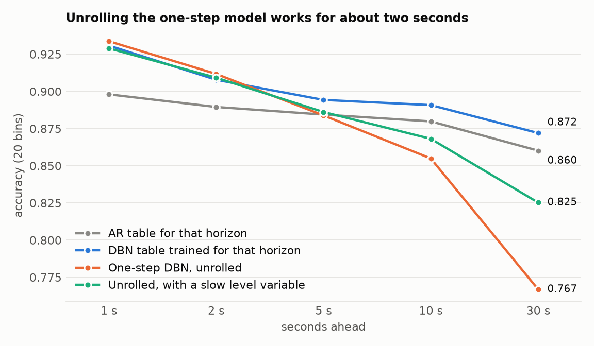
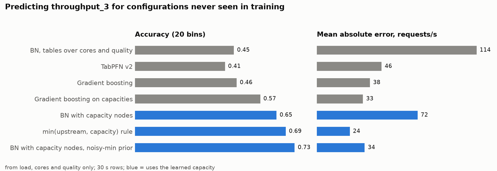
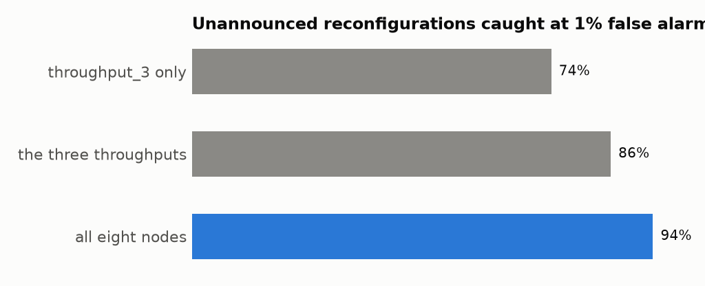
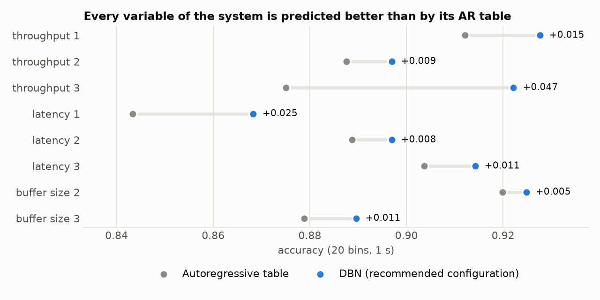

# Part 2 — regimes, roll-out, unseen configurations, capacity node, transfer

> **Corrected on 8 October after an external audit** — see
> [2026-10-08_audit_response.md](2026-10-08_audit_response.md). The roll-out and
> detection numbers below are the re-run ones. Intervals printed in this
> document resample runs; the three datasets share one configuration schedule,
> so the intervals to quote are the schedule-level ones in the audit response
> (wider, same conclusions).

7 October 2026, evening. Continues [2026-10-07_fixes_ablation_tabpfn.md](2026-10-07_fixes_ablation_tabpfn.md).
All numbers are pooled over the three datasets unless a dataset is named; the
target is `throughput_3`, 1 s, 20 bins, two lags, unless stated.

## Summary

1. **Regimes change the values, not the core structure.** One global model is
   as good as or better than regime-specific tables or structures, because its
   parents (queue length, upstream flow, the target's own level) already tell
   it which regime it is in. But a regime that was never in the training data
   is predicted badly, and the model's own surprise detects it only
   moderately well (§1).
2. **The DBN as one model of the chain can be unrolled, for about two seconds.**
   Beyond that, a table trained directly for the horizon is better, and beyond
   ~10 s plain AR is. A slow "level" state variable recovers about half of the
   accuracy lost to the direct table at 30 s (§2).
3. **For configurations never seen in training, tables over (cores, quality)
   fail; a learned capacity node fixes it.** Capacity = cores × rate(data
   quality), with one rate function shared by the three services, learned from
   saturated runs. With it, accuracy on unseen configurations goes from 0.45
   to 0.73, ahead of gradient boosting (0.46–0.57) (§3).
4. **The capacity node also improves the dynamic model at reconfigurations:**
   0.42 → 0.65 at 1 s, 0.74 → 0.84 at 30 s / 4 bins. Best overall figures so
   far: 0.922 against AR 0.875 (1 s, 20 bins); 0.959 against 0.920 (30 s,
   4 bins) (§4).
5. **Models transfer across workloads** as long as the training workload varied
   the load. Pooling the three workloads is best everywhere (§5).
6. **TabPFN v3.5** (run on 8 October; corrected after the audit, see
   [audit response §C](2026-10-08_audit_response.md)): given the same input
   columns as the recommended DBN, TabPFN v3.5 has the same bin accuracy at 1 s
   (0.924 against 0.922 at 20 bins) and is better in log-loss and as a number
   (2.8 against 3.7 requests/s); at 30 s the best TabPFN is ahead on every
   measure. On unseen configurations the DBN with capacity nodes is ahead
   (0.73 against 0.58).
7. **Detection works much better with the whole network than with one
   variable.** Summing the surprise of all eight nodes, an unannounced
   reconfiguration is caught 94% of the time at 1% false alarms (74% with
   `throughput_3` alone); an unseen saturation regime is separated with AUC
   0.98 (0.76) (§9).
8. **Adaptation is cheap.** After a new regime appears, re-estimating the
   tables on the data seen so far recovers most of the lost accuracy;
   re-running the parent search recovers nearly all of it (§10).
9. **Recommended configuration, all eight variables** (§11): two lags, parents
   limited to the variable's service and its input, capacity node, capacity
   chain at reconfigurations, conditional-median read-out. For `throughput_3`:
   accuracy 0.922 against AR 0.875 at 1 s; MAE 3.94 requests/s against 4.65 for
   persistence. (The comparison with TabPFN v2 in §11 gave the DBN more input
   columns than TabPFN and should not be quoted; see point 6.)

---

## 1. Regimes: structure or values?

`analysis/regime_study.py`. Two definitions of regime, both known per sample:

- **bottleneck** — where the chain saturates in the run: nowhere (`none`,
  ≈28% of runs), at service 1 (`s1`, ≈61%), or at service 2 or 3 (`s23`, ≈11%);
- **load** — low / mid / high third of the offered load.

Accuracy on the test samples of each regime:

| Regime | AR | **Global model** | + regime as a parent | Global structure, table per regime | Structure per regime | Regime never seen in training |
|---|---|---|---|---|---|---|
| all | 0.875 | **0.918** | 0.907 | 0.902 | 0.896 | 0.823 |
| none | 0.945 | **0.962** | 0.951 | 0.944 | 0.942 | 0.896 |
| s1 | 0.868 | **0.917** | 0.909 | 0.914 | 0.909 | 0.796 |
| s23 | 0.749 | **0.821** | 0.793 | 0.743 | 0.718 | 0.785 |
| load: low | 0.896 | **0.929** | 0.924 | 0.918 | 0.915 | 0.924 |
| load: mid | 0.871 | **0.914** | 0.912 | 0.908 | 0.913 | 0.893 |
| load: high | 0.865 | **0.918** | 0.907 | 0.898 | 0.901 | 0.847 |

What this says:

- **Splitting the model by regime does not help.** Giving each regime its own
  table, its own structure, or adding the regime label as a parent is never
  better than the single global model, and is clearly worse for the rare
  regime (`s23`: 0.72–0.79 against 0.82), which has too little data on its own.
- **Why:** the global model's parents already carry the regime.
  `buffer_size_3` says whether service 3 is backed up, `throughput_2` against
  `throughput_3` says who is limiting whom. The table has a separate row for
  each of those situations, i.e. it *is* regime-specific in its values.
- **Structure:** the global search selects `throughput_3(t)`, `throughput_2(t)`
  and `throughput_2(t−1)` in all 15 fits. Searches run on one regime's data
  alone are less stable: all three are selected in 13 of 15 fits for `s1`,
  8 of 15 for `none` and 6 of 15 for `s23`. When the bottleneck is at service 2 or
  3 the search often drops `throughput_2` in favour of latency, the target's
  own lag and the quality setting — when service 3 is the limit, its output no
  longer follows its input. So the structure does shift in that regime, but
  the global structure with the queue as a parent covers it better than a
  dedicated one.
- **A regime the model has never seen is a different matter:** accuracy falls
  by 3.6 points for `s23`, 6.6 for `none` and 12.1 for `s1` (0.917 → 0.796),
  and log-loss rises by a factor of 1.4 to 3.8. The tables do
  not extrapolate. This is the case that matters for fault injection.

**Detecting a regime the model was not trained on**, from its surprise
(−log p of what happened), per run: AUC 0.75 (`s1`), 0.80 (`s23`), 0.60
(`none`); for load regimes 0.50–0.63. Mean surprise roughly doubles in an
unseen regime (0.28–0.41 → 0.72–0.91). The AR table's surprise is a slightly
worse detector (0.55–0.77).

**Detecting an unannounced reconfiguration** (the model is not told the new
configuration; alarm = surprise on a single step):

| | AUC | Reconfigurations caught at 1% false alarms |
|---|---|---|
| DBN, 1 s | 0.880 | 74% |
| AR, 1 s | 0.884 | 68% |
| DBN, 30 s | 0.881 | 31% |
| AR, 30 s | 0.879 | 31% |

(The alarm threshold is set on the ordinary steps of a random half of the test
runs and the rates are measured on the other half, where it produced 1.0–1.4%
false alarms. The first version of this table set the threshold on the same
steps it was scored on.)

About a quarter of reconfigurations do not move `throughput_3` out of its bin
and cannot be seen by any detector on that variable.

**For the next step of the thesis** this suggests: (i) known regimes do not
need separate models as long as the variables that identify the regime are
parents; (ii) an unknown regime (a fault) shows up as sustained surprise and
needs new data or a model with more structure (§3 is one example of structure
that extrapolates); (iii) detection from a single variable's surprise is
moderate — combining the surprise of all nodes of the DBN is the obvious next
test, and was not done here.

## 2. The chain as one model, rolled forward

`dbn/rollout.py`. State = the three throughputs and the two queue lengths at t
and t−1; each has one table; the model is unrolled with 100 particles from
3 000 test origins per fold. Accuracy for `throughput_3`:

| Forecast | 1 s | 2 s | 5 s | 10 s | 30 s |
|---|---|---|---|---|---|
| Persistence | 0.900 | 0.892 | 0.887 | 0.881 | 0.862 |
| AR table for that horizon | 0.898 | 0.890 | 0.884 | 0.880 | 0.860 |
| **Direct table for that horizon** | 0.931 | 0.907 | **0.894** | **0.891** | **0.872** |
| Roll-out, learned structure | 0.930 | 0.909 | 0.883 | 0.853 | 0.771 |
| Roll-out, parents limited to own service + input | **0.934** | **0.912** | 0.884 | 0.855 | 0.767 |
| Roll-out, + same-slice chain edge | 0.929 | 0.911 | 0.877 | 0.844 | 0.775 |
| Roll-out, + cores and quality forced | 0.906 | 0.898 | 0.861 | 0.811 | 0.707 |
| Roll-out, + capacity node forced | 0.917 | 0.904 | 0.879 | 0.850 | 0.779 |
| Roll-out, + slow level variable | 0.929 | 0.909 | 0.886 | 0.868 | 0.825 |

(Re-run on 8 October: in the first version the capacity node was offered as a
candidate parent to every structure, and was picked in 47 of the 630
non-capacity structure rows. Here only the "capacity" row has it. The numbers
moved by at most 0.007.)

- Up to 2 s the unrolled one-step model is as good as or better than a table
  trained for that horizon. From 5 s it falls behind, and from 10 s it is
  worse than persistence.
- The cause: a table over the bins of `v(t)` has no memory of the level the
  variable has been running at. Each step adds a little noise and nothing
  pulls the sample back, so the particles diffuse.
- Adding an exponential moving average of each throughput as a slow state
  variable (updated deterministically) gives the model something to return to:
  compared with the same structure without it, accuracy goes from 0.767 to
  0.825 at 30 s and from 0.855 to 0.868 at 10 s. It does not close the gap to
  the direct table (0.872 and 0.891). A variant in which the level variable is
  only offered to the search instead of forced (`level?` in the result files)
  gives 0.816 at 30 s.
- Knowing the future load or freezing it at its current value makes no
  difference to any of these (the selected parents rarely include the load).
- The same pattern holds for `throughput_1` and `throughput_2`
  (`results/rollout/*_summary.csv`).

Practical reading: for "what happens in the next second or two" the DBN can
be used as one generative model of the chain; for longer horizons train the
tables for the horizon wanted, or give the state a slow component.

## 3. Configurations the model has not seen

`analysis/whatif_study.py`. No history: predict each service's throughput from
the load and the six settings only (30 s rows). Because every combination of
cores is visited for ten consecutive runs, 92% of the test rows have a
combination of settings that never occurred in training.

**The capacity node.** In saturated runs the throughput of a service is, very
closely, `cores × rate(data_quality)`, with the same rate for all three
services (they run the same code):

| data quality | 300 | 400 | 500 | 600 | 700 | 800 | 900 | 1000 |
|---|---|---|---|---|---|---|---|---|
| requests/s per core, as estimated | 200 | 117 | 77 | 56 | 45 | 34 | 29 | 26 |
| median over saturated runs only | 177 | 110 | 71 | 52 | 41 | 33 | 28 | 25 |

(periodic dataset, last fold.)

`data.fit_capacity_rate` learns this table from the training runs: the median
over saturated runs, raised to the largest throughput per core seen in an
unsaturated run when that is higher (a service that keeps up cannot be over
capacity; at quality 100 and 200 services almost never saturate and this bound
is all there is), and forced to be non-increasing in quality. The estimate
sits 3% (quality 800–1000) to 13% (quality 300) above the plain saturated
median; see the open points. `capacity_i = cores_i × rate(quality_i)` is then
an ordinary exogenous variable on the same bins as the flows.

Results on the unseen configurations (15 480 rows):

| Model | throughput_1 acc / MAE | throughput_2 acc / MAE | throughput_3 acc / MAE |
|---|---|---|---|
| Table chain: P(flow_i given upstream, cores_i, quality_i) | 0.71 / 43 | 0.55 / 96 | 0.45 / 114 |
| Capacity chain: P(flow_i given upstream, capacity_i), uniform prior | 0.81 / 16 | 0.70 / 56 | 0.65 / 72 |
| **Capacity chain, noisy-min prior** | 0.88 / 6.0 | **0.75** / 28 | **0.73** / 34 |
| Min rule: flow_i = min(upstream, capacity_i), no tables | **0.89 / 2.2** | 0.74 / **19** | 0.69 / **24** |
| Gradient boosting on (load, cores, quality) | 0.83 / 6.0 | 0.53 / 31 | 0.46 / 38 |
| Gradient boosting on (load, capacities) | 0.92 / 2.3 | 0.65 / 25 | 0.57 / 33 |
| TabPFN v2 on (load, cores, quality), median forecast | **0.93** / 2.3 | 0.51 / 34 | 0.41 / 46 |

- A table treats `cores = 4` and `cores = 5` as unrelated labels, so it has
  nothing to say about a combination it has not seen (uniform prediction).
- Turning the two settings into one physical quantity makes configurations
  comparable, and the table then generalises.
- "Noisy-min prior": the table of a flow is learned as usual but its prior is
  centred on the bin of min(upstream, capacity) rather than uniform. This is a
  structured table in the Bayesian-network sense, and it is what makes the
  chain beat gradient boosting here.
- The deterministic min rule has the lowest error in requests/s; the
  probabilistic chain has the best bin accuracy and gives a distribution.
- TabPFN v2 is very good for the first service (whose throughput depends on
  three inputs) and no better than gradient boosting for the third (seven
  inputs, and a bottleneck that can be anywhere): without the capacity
  structure, neither generalises to unseen combinations. Its mean forecast is
  much worse than its median here (MAE 80 against 46 for `throughput_3`); the
  median is what is reported.

## 4. Capacity node in the dynamic model

`dbn/ablation.py --study capacity` (the rate function is learned on the first
sixth of the runs, which is training data in every fold).

| Setting | AR | Chain at reconfigurations (previous best) | **Capacity chain, noisy-min** | Accuracy at reconfigurations: before → after |
|---|---|---|---|---|
| 1 s, 20 bins | 0.875 | 0.919 | 0.920 (0.922 with candidates limited to the service) | 0.42 → 0.65 |
| 1 s, 10 bins | 0.924 | 0.940 | 0.940 (0.946) | 0.54 → 0.73 |
| 30 s, 4 bins | 0.920 | 0.949 | **0.959** | 0.74 → 0.84 |
| 30 s, 10 bins | 0.880 | 0.914 | **0.926** | 0.60 → 0.73 |
| 30 s, 20 bins | 0.837 | 0.865 | **0.890** | 0.45 → 0.70 |

Inside a run the capacity adds nothing (it is constant there, like the
settings it is made of). MAE at 30 s / 20 bins falls from 20.1 to 14.2
requests/s (persistence 17.6). For `throughput_1` the accuracy at
reconfigurations goes from 0.67 to 0.86, for `throughput_2` from 0.53 to 0.70.

## 5. Transfer across workloads

`analysis/transfer_study.py`. Train on the training runs of one dataset, test
on the test runs of another (same configurations, different load pattern).
Accuracy of the DBN; rows = trained on, columns = tested on.

| Trained on | constant | periodic | unpredictable |
|---|---|---|---|
| constant load | 0.920 | 0.842 | 0.849 |
| periodic | 0.914 | 0.922 | 0.895 |
| unpredictable | 0.912 | **0.925** | 0.912 |
| **all three pooled** | **0.926** | **0.933** | **0.918** |

- A model trained on a varying load transfers to the other workloads with
  little or no loss; the one trained on random load steps is as good on the
  periodic data as the periodic model itself.
- A model trained on the constant-load dataset does not transfer: it has
  never seen other load levels.
- Pooling is best in every column, +0.6 to +1.1 points over training on the
  target workload alone.
- In all twelve cells the DBN is 3.5 to 5.2 points above the AR table trained
  on the same data.

With the recommended configuration of §11 the same pattern holds one notch
higher: pooled training gives 0.927 / 0.934 / 0.922 (constant / periodic /
unpredictable) against 0.874 / 0.888 / 0.866 for AR, the highest figures
obtained for `throughput_3` at 1 s and 20 bins.

## 6. TabPFN v3.5

> **Read this section together with [audit response §C](2026-10-08_audit_response.md).**
> In the table below the DBN is the recommended configuration (two time steps,
> capacity node) while TabPFN was given one time step and no capacity. With
> the same inputs TabPFN v3.5 matches the DBN's accuracy at 1 s and is better in
> log-loss and MAE; the first reading point below does not hold on equal inputs.

Run on 8 October after the Prior Labs licence was accepted (the library needs
its own licence step at https://ux.priorlabs.ai in addition to the Hugging Face
login; on this Python, prefix commands with `SSL_CERT_FILE=$(python -m certifi)`).
Same protocol as before: same folds and test samples for every model, 10 000
random training samples as TabPFN's context at 1 s, everything at 30 s.
"DBN" is the recommended configuration of §11; its MAE is the
conditional-median read-out. Differences are DBN minus TabPFN, 95% interval
over runs.

| Setting | Accuracy: DBN / TabPFN v3.5 | Difference | Log-loss: DBN / TabPFN | MAE: DBN / TabPFN | Difference |
|---|---|---|---|---|---|
| 1 s, 10 bins | **0.948** / 0.942 | +0.006 [0.002, 0.010] | 0.194 / **0.169** | 4.17 / **3.52** | +0.65 [0.27, 1.01] |
| 1 s, 20 bins | **0.922** / 0.906 | +0.017 [0.012, 0.021] | 0.270 / 0.272 | 3.72 / 3.52 | +0.20 [−0.14, +0.49] |
| 1 s, 50 bins | **0.878** / 0.860 | +0.019 [0.013, 0.025] | 0.413 / 0.431 | 3.75 / 3.52 | +0.24 [−0.17, +0.64] |
| 30 s, 20 bins | 0.889 / 0.890 | −0.001 [−0.007, +0.005] | 0.614 / **0.389** | 10.4 / **6.5** | +3.9 [3.1, 4.7] |
| 30 s, 4 bins | 0.959 / **0.968** | −0.009 [−0.013, −0.005] | 0.167 / **0.100** | 11.2 / **6.5** | +4.7 [4.0, 5.4] |

Configurations never seen in training (§3 protocol, `throughput_3`): TabPFN
v3.5 accuracy 0.58, MAE 33 requests/s — against 0.73 / 34 for the DBN with
capacity nodes and 0.69 / 24 for the min rule. (v2 was 0.41 / 46.)

Reading:

- **At 1 s the DBN is ahead of TabPFN v3.5 in bin accuracy** in all three bin
  counts, level in log-loss at 20 and 50 bins, and statistically level as a
  numeric forecast at 20 and 50 bins (TabPFN is nominally 0.2 requests/s
  better).
- **At 30 s TabPFN v3.5 is clearly the better model**: level or ahead in
  accuracy, much better calibrated, and its numeric error is 6.5 against 10.4
  requests/s. v3.5 is a large step up from v2 here (v2: 11.3). At 30 s most of
  what there is to predict is the effect of a new configuration, where a
  flexible regressor on continuous inputs has the advantage over tables.
- **For configurations it has not seen, TabPFN v3.5 is at the level of gradient
  boosting** and behind the DBN with capacity nodes in accuracy: the physical
  structure still matters there.
- TabPFN is restricted to a 10 000-sample context at 1 s (of up to 167 000);
  the DBN uses all of it.

## 7. What to run on the other machine

Long jobs that were deliberately not started here:

| Job | Command | Rough time |
|---|---|---|
| Full pgmpy sweep, corrected data, per dataset | `python dbn/dbn_sweep.py --csv data/dbn_wide_<stem>.csv --granularity 1 --n-bins 10 20 30` | ≈ 20 h |
| The same at 30 s (for a like-for-like replacement of the old figures) | `… --granularity 30 --n-bins 4 10 20` | ≈ 2 h |
| TabPFN v3.5, all settings | see §6 | ≈ 1 h per dataset on this Mac's GPU |
| All harness studies under a clean commit | `for s in $(python dbn/ablation.py --list-studies \| cut -d: -f1); do python dbn/ablation.py --csv … --study $s; done` | ≈ 40 min per dataset |

The other machine needs the three raw dumps (or the regenerated
`data/dbn_wide_*.csv`, 135 MB each), `pip install -r requirements.txt`, and
for TabPFN the two logins.

## 9. Detection with the whole network

`analysis/adaptation_study.py --part detection`. Each of the eight
non-exogenous variables has its own table and its own surprise; the alarm
score is their sum.

**Unannounced reconfiguration, single step** (the models are not told the new
configuration):

| Score | AUC | Caught at 1% false alarms |
|---|---|---|
| `throughput_3` only | 0.880 | 74% |
| the three throughputs | 0.915 | 86% |
| **all eight nodes** | **0.984** | **94%** |

(Held-out threshold, as in §1; realised false alarms 0.9–1.4%.)

**A bottleneck regime that was not in the training data, per run** (AUC):

| Unseen regime | Surprise, target only | Surprise, all nodes | Miscalibration, all nodes |
|---|---|---|---|
| s1 (service 1 saturates) | 0.76 | **0.98** | 0.96 |
| s23 (service 2 or 3 saturates) | **0.80** | 0.64 | 0.62 |
| none (nothing saturates) | 0.60 | 0.30 | **0.79** |

- Summed surprise is an excellent detector when the new regime is *harder*
  than what the model knows (`s1`).
- When the new regime is *easier* (`none`: nothing saturates, everything is
  steady) the runs are less surprising than the known ones, and plain surprise
  points the wrong way (AUC 0.30). "Miscalibration" — how far the surprise is
  from the entropy the model itself predicted, in absolute value — catches
  both directions (0.79 and 0.96).
- `s23` is rare (≈60 runs per dataset) and affects mainly service 3; adding the
  other nodes dilutes it. A detector per service, or a weighted sum, is the
  next thing to try.

**How long it takes.** A two-sided CUSUM on the per-second miscalibration,
tuned on half of the known-regime test runs so that 5% of them raise an alarm
somewhere in their six minutes:

| Unseen regime | Nodes | False alarms (held-out known runs) | Runs of the new regime detected | Median seconds to alarm |
|---|---|---|---|---|
| s1 | target only | 5% | 22% | 163 |
| s1 | **all nodes** | 7% | **75%** | **79** |
| none | all nodes | 3% | 31% | 166 |
| s23 | all nodes | 5% | 16% | 150 |

**Per-service detectors localise the change.** Summing only the nodes of one
service (its throughput, latency and queue):

| Unseen regime | Detector | Run-level AUC (surprise) | Runs detected by CUSUM | Median seconds to alarm |
|---|---|---|---|---|
| s1 | **service 1** | **0.997** | **98%** | **13** |
| s1 | service 2 | 0.890 | 23% | 157 |
| s1 | service 3 | 0.801 | 20% | 149 |
| s23 | service 3 | 0.726 | 15% | 167 |
| s23 | `throughput_3` alone | 0.801 | 22% | 188 |

When service 1 enters a saturation regime the model has never seen, the
detector built from service 1's own nodes fires in 98% of the runs, within
about 13 seconds, while the detectors of the other services mostly stay
quiet: the alarm also says *where*. For an unannounced reconfiguration (one
step) the per-service detectors catch 86–91% at 1% false alarms, all nodes
together 94%.

A regime in which the first service saturates is noticed in three quarters of
the runs, typically within 80 seconds, by the all-node detector. The other two are mostly missed by this
detector within one run; they are the cases where the system behaves "like
before, only calmer" or where the difference is confined to one service.

## 10. Adapting after a new regime appears

`analysis/adaptation_study.py --part adaptation`. The `throughput_3` model is
trained on the first half of the runs without regime r; the second half then
arrives run by run. Accuracy on the runs of r once more than ten of them have
been seen:

| Regime that was missing | Never updated | Tables re-estimated every 5 runs | + parents searched again every 20 runs | Regime was in the training data |
|---|---|---|---|---|
| s1 | 0.786 | 0.888 | 0.913 | 0.926 |
| none | 0.931 | 0.964 | 0.965 | 0.975 |
| s23 | 0.824 | 0.845 | 0.832 | 0.841 |

(log-loss for s1: 0.848 → 0.387 → 0.312, against 0.258.)

The tables are counts, so "updating the model" is just adding the new
observations; no retraining procedure is needed. For `s1`, updating recovers
about three quarters of the gap and re-searching the structure most of the
rest. This is the "adjust the model when a regime change is detected" loop in
its simplest form: §9 raises the alarm, this section is the response.

## 11. Recommended configuration, for every variable

`dbn/ablation.py --study recommended`: two lags of every variable; parents
limited to the variable's own service and what flows into it; capacity node;
capacity chain with noisy-min prior at reconfigurations; conditional-median
node for the numeric forecast. 1 s, 20 bins:

| Target | Accuracy: AR | DBN | gain [95%] | MAE: persistence | DBN table | **DBN conditional median** |
|---|---|---|---|---|---|---|
| throughput_1 | 0.912 | 0.928 | +0.016 [0.013, 0.018] | 1.57 | 1.72 | **1.26** |
| throughput_2 | 0.888 | 0.897 | +0.009 [0.005, 0.014] | 4.21 | 5.24 | **3.88** |
| throughput_3 | 0.875 | **0.922** | +0.047 [0.042, 0.053] | 4.65 | 5.47 | **3.94** |
| avg_p_latency_1 | 0.843 | 0.868 | +0.025 [0.022, 0.028] | 0.426 | 0.454 | **0.389** |
| avg_p_latency_2 | 0.889 | 0.897 | +0.008 [0.006, 0.011] | 0.378 | 0.415 | **0.354** |
| avg_p_latency_3 | 0.904 | 0.914 | +0.011 [0.009, 0.012] | 0.304 | 0.362 | **0.282** |
| buffer_size_2 | 0.920 | 0.925 | +0.005 [0.004, 0.006] | 40.1 | 40.6 | **32.6** (linear per regime: 26.8) |
| buffer_size_3 | 0.879 | 0.890 | +0.011 [0.008, 0.013] | **24.7** | 32.5 | 25.8 (linear per regime: 23.7) |

With 50 bins the gains over AR are larger (`throughput_3` +0.071,
`throughput_2` +0.039, `avg_p_latency_1` +0.036). For `throughput_3` at 30 s:
accuracy 0.959 / 0.926 / 0.889 with 4 / 10 / 20 bins (AR 0.920 / 0.880 /
0.837), conditional-median MAE 11.2 / 10.8 / 10.4 requests/s (persistence
17.6; TabPFN v2 11.3 and gradient boosting 13.5 on the same test rows).

The queue lengths are the one family where a linear node does better than the
median: a queue grows or shrinks by (input − output) every second, which is
linear.

### Recommended DBN against TabPFN v2, same test samples

> Unequal inputs: the DBN here sees two time steps and the capacity node,
> TabPFN v2 one time step and no capacity. Kept for the record; the equal-input
> comparison (with v3.5) is in the [audit response §C](2026-10-08_audit_response.md).

`analysis/tabpfn_baseline.py` now also scores the recommended configuration
(`dbn_rec`, and `dbn_rec_median` for its numeric forecast) on exactly the
samples TabPFN is tested on. Pooled over the three datasets; differences are
DBN minus TabPFN with 95% intervals over runs.

| Setting | Accuracy: DBN / TabPFN v2 | Difference | Log-loss: DBN / TabPFN v2 | MAE: DBN median / TabPFN v2 | Difference |
|---|---|---|---|---|---|
| 1 s, 20 bins | **0.922** / 0.902 | +0.021 [0.015, 0.026] | **0.270** / 0.387 | 3.72 / 3.92 | −0.21 [−0.45, +0.03] |
| 1 s, 50 bins | **0.878** / 0.855 | +0.023 [0.017, 0.030] | **0.413** / 0.572 | 3.75 / 3.92 | −0.17 [−0.48, +0.19] |
| 30 s, 20 bins | **0.889** / 0.848 | +0.041 [0.032, 0.050] | 0.614 / **0.573** | **10.4** / 11.3 | −0.87 [−1.73, −0.03] |
| 30 s, 4 bins | **0.959** / 0.947 | +0.012 [0.007, 0.018] | 0.167 / 0.171 | 11.2 / 11.3 | −0.07 [−0.89, +0.71] |

(gradient boosting: accuracy 0.893 / 0.832 / 0.828 / 0.934, MAE 4.13 at 1 s and
13.5 at 30 s.) With the recommended configuration the DBN is ahead of TabPFN
v2 in bin accuracy in all four settings and level with it, or slightly ahead,
as a numeric forecast. This replaces the comparison in §7 of the first report,
where the DBN was the earlier reference configuration. TabPFN v3.5 remains to
be run — done since, see §6.

## 12. Smaller tests

- **Slow level variable in the one-step model** (`level=True`): no gain one
  second ahead (−0.002); +0.002 to +0.007 accuracy at 5 and 10 s. It matters
  for the unrolled model (§2), not for direct tables.
- **DYNOTEARS penalty** λ ∈ {0.002, 0.005, 0.02, 0.05, 0.1}: gain over AR
  +0.014 to +0.020, best at 0.02. It stays behind the discrete searches at
  every setting.

## 13. The corrected pgmpy sweep at 30 s (partial)

`dbn_sweep.py --granularity 30 --n-bins 4 10 20` was started on the three
datasets and stopped after 383 of the 1 080 configurations (all of K = 4 and
most of K = 8), because the rest would have taken about five more hours; the
full grid is in `scripts/run_long_jobs.sh` for the other machine. The numbers
below are read from the logs
(`results/sweeps/dbn_k_sweep_partial_30s_from_logs_20261007.csv`).

| Bins | Score | DBN accuracy | AR accuracy | Gain | Share of configurations above AR |
|---|---|---|---|---|---|
| 4 | AIC | 0.913 | 0.911 | +0.002 | 68% |
| 4 | BIC | 0.913 | 0.910 | +0.002 | 75% |
| 10 | AIC | 0.852 | 0.848 | +0.004 | 95% |
| 10 | BIC | 0.848 | 0.847 | +0.001 | 40% |
| 20 | AIC | 0.778 | 0.774 | +0.004 | 71% |
| 20 | BIC | 0.774 | 0.773 | +0.001 | 67% |

- No fold failed in any of the 383 configurations (the old logs had failures
  in every run).
- At 30 s the sweep is level with AR, never clearly below it as before
  (largest loss −0.007, largest gain +0.018). This agrees with the harness:
  at 30 s there is nothing to gain inside a run, and the gain at
  reconfigurations needs the chain / capacity inference of §4, which the
  sweep does not have. The sweep's own gain is at 1 s (0.912 against 0.887 on
  the small grid of the first report).
- The discretiser changes the level of both models (uniform ≈ 0.89, quantile ≈
  0.80, with different bins) but not the gap.

## 8. Open

- Detection: per-service or weighted combinations of node surprises; a
  sequential test (CUSUM) on the summed surprise instead of one step or one
  run mean; real injected faults rather than reconfigurations.
- Capacity node inside the roll-out with the noisy-min prior (only the plain
  forced-parent form was tried, §2).
- Rate function for quality 100 and 200 rests on lower bounds only; runs that
  saturate at low quality (more load, or fewer cores) would pin it down.
- The capacity estimator matters: three variants tried during the session
  gave, for the min rule on the periodic dataset, accuracy 0.70–0.75 and MAE
  23–27 requests/s (the one kept has the lowest MAE). A proper censored
  regression of capacity on (cores, quality) would be the clean way to do it.
